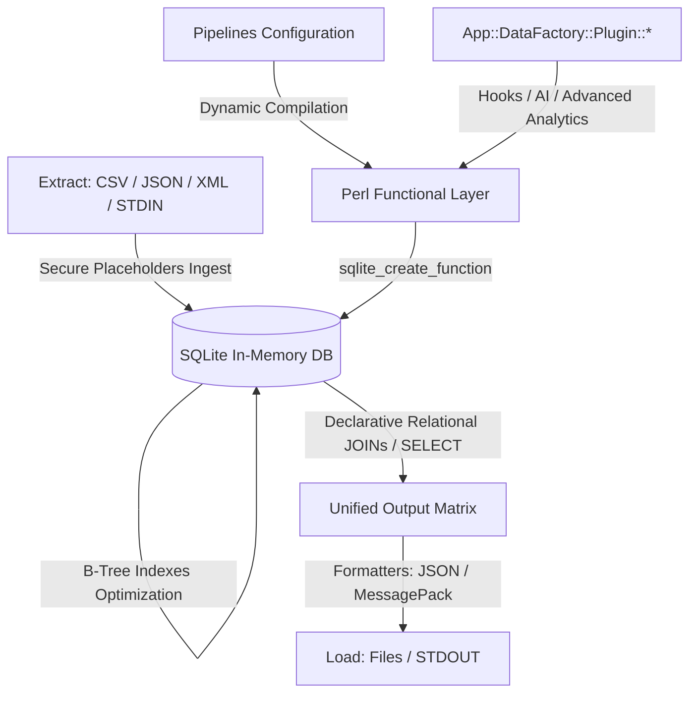

[](https://github.com/borg-1of9/App-DataFactory/actions?workflow=test)
# NAME

App::DataFactory - Extensible Pipeline Data Ingestion and Relational Transformation Engine

# App::DataFactory

App::DataFactory is a highly-extensible, secure, and blazing-fast data engineering command-line utility and library written in Perl. It safely ingests diverse, multi-format raw datasets (CSV, JSON, XML, MessagePack) or live streams into an ephemeral, memory-mapped SQLite database workspace.

Custom data-cleansing pipelines declared in configuration files are dynamically compiled into native SQL functions, enabling complex relational transformations, multi-source `JOIN` operations, and schema filtering on a single execution pass.

The utility operates natively in two modes:
1. **Hybrid Mode**: Merges persistent static configuration definitions on disk with shifting data streams from local paths or `STDIN`.
2. **Monolithic Microservice Mode**: Ingests both execution blueprint rules and row record payloads packed inside a single compound JSON buffer through standard input, running entirely in-memory with zero host storage attachments.

---

## Architecture Overview

App::DataFactory unifies the raw structural relational power of SQL with the agile text-manipulation capability of Perl. By abstracting operations into standard ETL sequences, it avoids heavy in-memory Perl nested hash operations.



### Core Architecture Stages:
1. **Extract**: Parses external file descriptors or memory pipes into memory tables. Employs binding execution placeholders (`?`) across all ingest queries to completely eliminate SQL Injection threats.
2. **Transform**: Registers reusable ordered functional pipeline chains or plugin components into the virtual database environment as standard SQL routines (`PIPE_*`) before running raw relational schema modifications.
3. **Load**: Serializes structured response matrices containing automated execution telemetry, operational status, and records collections out to files or `STDOUT`.

---

## Installation & Requirements

### Prerequisites
- Perl 5.14+ (Perl 5.34+ highly recommended)
- Standard compilation tools (`make`, `gcc`, `libxml2-dev` for XML parsing extensions)

### Installing Required CPAN Extensions
Install missing framework components using `cpanm` (CPAN Minus):
```bash
cpanm Try::Tiny YAML::XS DBI DBD::SQLite Text::CSV_XS JSON::XS XML::LibXML Data::MessagePack Capture::Tiny
```

### Building From Source
```bash
git clone https://github.com/borg-1of9/datafactory
cd App-DataFactory
perl Makefile.PL
make
make test
sudo make install
```

### Uninstallation
To completely scrub the application and binary hooks from your operating system:
```bash
sudo rm -f $(which datafactory)
sudo rm -rf /usr/local/share/perl5/site_perl/App/DataFactory*
```

---

## Global Configuration Schema (`config.yaml`)

The blueprint file structure uses clean ETL organization matrices:

```yaml
---
# 1. Sequential pipeline chains mapping text transformation routines
pipelines:
  normalize_source:
    - to_lower: ""
    - trim: ""

# 2. EXTRACT: Data ingestion and structural mapping rules
extract:
  - id: "csv_source"
    type: "file"
    name: "t/data/test_data.csv"
    sep_char: ";"
    binary: true
    # Directly maps sequential source indexes to database column IDs
    mapping:
      0: "code"
      1: "name"
      3: "source_type"
    # Automatically triggers B-Tree index creation instantly after commit
    indexes:
      - "code"
      - "source_type"

  - id: "json_source"
    type: "file"
    name: "t/data/test_data.json"
    name_id: ["device_type", "status", "firmware"]

  - id: "xml_source"
    type: "file"
    name: "t/data/test_data.xml"
    root_node: "/inventory/item"
    columns: ["hw_code", "location"]


# 3. TRANSFORM: Ephemeral relational schema manipulation queries
transform:
  - id: "consolidated_view"
    query: >
      SELECT
        c.code AS device_code,
        c.name AS device_name,
        j.status AS current_status,
        j.firmware AS firmware_version,
        x.location AS warehouse_location
      FROM csv_source c
      LEFT JOIN json_source j ON PIPE_normalize_source(c.source_type) = j.device_type
      LEFT JOIN xml_source x ON c.code = x.hw_code

# 4. LOAD: Unified output serialization definitions
load:
  - source_id: "consolidated_view"
    type: "stdout"
    name: "-"
    format: "json"
    pretty: true
```

---

## Core Feature Showcases

### Schema Auto-Discovery (Schema-less Ingestion)
If the `mapping` or `columns` fields are completely omitted inside an `extract` configuration profile block, the engine automatically interrogates the structural layout boundaries from the very first row record:
1. Diagnostic warning alerts are safely route-dispatched to `STDERR` to keep `STDOUT` clean.
2. All discovered fields are securely allocated under `TEXT` storage affinities.
3. Fields are automatically assigned zero-based sequential system markers: **`col0`, `col1`, ... `colN`**.

#### Querying Auto-Generated Columns:
```yaml
transform:
  - id: "dynamic_view"
    query: >
      SELECT
        col0 AS record_id,
        CAST(col2 AS INTEGER) * 1.21 AS vat_price
      FROM raw_logs
      WHERE col3 = 'active'
```

### Native SQL Functions Interoperability
Because queries are passed straight to SQLite, you can use all standard SQL built-in tools side-by-side with your perlobject pipelines (`PIPE_*`):
- **Date Utilities**: `date(col3, '+1 day')`, `strftime('%Y', col3)`
- **Strings**: `LENGTH(col1)`, `SUBSTR(col2, 1, 4)`, `COALESCE(col4, 'N/A')`
- **Math**: `ROUND(col5, 2)`, `ABS(col6)`, `AVG(CAST(col7 AS REAL))`

---

## Command Line Interface (CLI) Manual

### Basic Usage Patterns
```bash
# Launch a persistent file-based automation blueprint profile
datafactory --config pipeline.yaml

# Shortcut argument options string syntax
datafactory -c pipeline.yaml

# Show comprehensive application help information and manuals
datafactory --help
```

### Microservice Streaming Execution (Pure STDIN)
Feed the runtime configuration schema alongside dataset payloads together into a compound stream packet. No volume mounting or file path configuration on disk is required:
```bash
cat monolithic_payload.json | datafactory
```

---

## Unified Response Matrix Format
App::DataFactory communicates using a strict **Unified Response Pattern** across both JSON and MessagePack targets. Even during catastrophic core execution script processing failures, a valid serialized block is returned to `STDOUT` so remote orchestrators (e.g., a WebSocket server) can gracefully catch the exception schema metadata:

### Success Output Object Structure
```json
{
  "success": 1,
  "error": null,
  "data": [
    {
      "device_code": "id1435",
      "device_name": "Main Router Base",
      "current_status": "operational"
    }
  ]
}
```

### Failure Output Object Structure
```json
{
  "success": 0,
  "error": {
    "component": "Extractor",
    "message": "Unable to open physical source data stream 't/data/wrong.csv': No such file"
  },
  "data": null
}
```

---

## Modular Plugin Development

Extend data parsing, apply mathematical analysis, or trigger external localized AI models (e.g., via local Ollama endpoint API calls) by dropping a custom package file under the `App/DataFactory/Plugin/` folder namespace path.

### Custom Plugin Implementation Template
```perl
package App::DataFactory::Plugin::Anonymizer;

use strict;
use warnings;
use Digest::SHA qw(sha256_hex);

# The framework manager automatically registers hooks compiled inside this subroutine
sub register_functions {
    return {
        'AI_HASH_MASK' => sub {
            my ($input_string, $salt) = @_;
            return undef unless defined $input_string;
            $salt //= "factory_secure_salt";
            return substr(sha256_hex($input_string . $salt), 0, 16);
        }
    };
}

1;
```
Once deployed, the customized expression `AI_HASH_MASK(column_id)` becomes instantly executable directly inside any query string within the `transform` definitions block.

---

## Containerization & Docker Blueprints

### Dockerfile
```dockerfile
FROM perl:5.38-slim

RUN apt-get update && apt-get install -y \
    build-essential \
    libxml2-dev \
    && rm -rf /var/lib/apt/lists/*

RUN cpanm --notest Try::Tiny YAML::XS DBI DBD::SQLite Text::CSV_XS JSON::XS XML::LibXML Data::MessagePack Capture::Tiny

WORKDIR /usr/src/app
COPY . .

RUN perl Makefile.PL && make && make install

ENTRYPOINT ["datafactory"]
CMD ["--help"]
```

### Building and Running the Image
```bash
# Build image locally
docker build -t borg-1of9/datafactory:latest .

# Run container in Hybrid Mode (Mounting local testing data volumes paths)
docker run --rm -v $(pwd)/t/data:/data borg-1of9/datafactory:latest --config /data/config.yaml

# Run container in Streaming Microservice Mode (Pure decoupled STDIN/STDOUT)
cat t/data/monolithic_payload.json | docker run -i --rm borg-1of9/datafactory:latest
```

# LICENSE

Copyright (C) Vladislav Kantor.

This library is free software; you can redistribute it and/or modify
it under the same terms as Perl itself.

# AUTHOR

Vladislav Kantor <kantor.vladislav@gmail.com>
